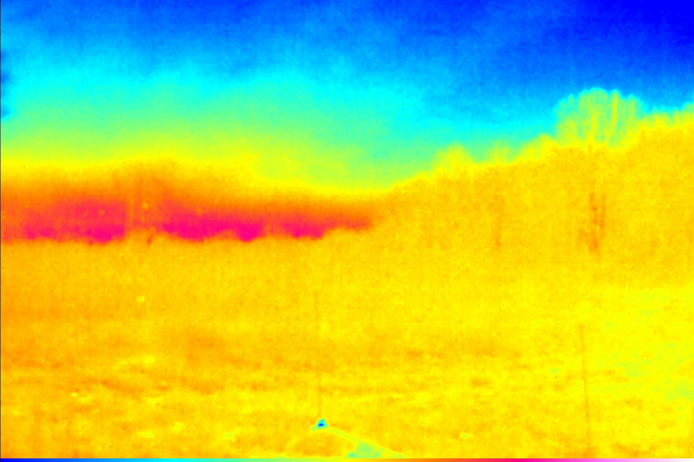
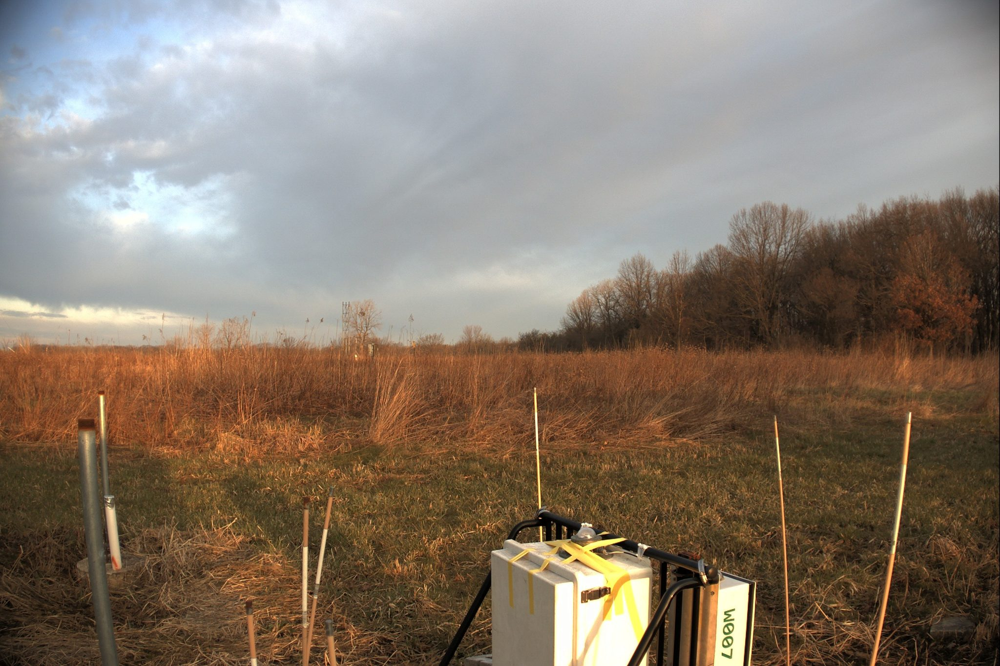
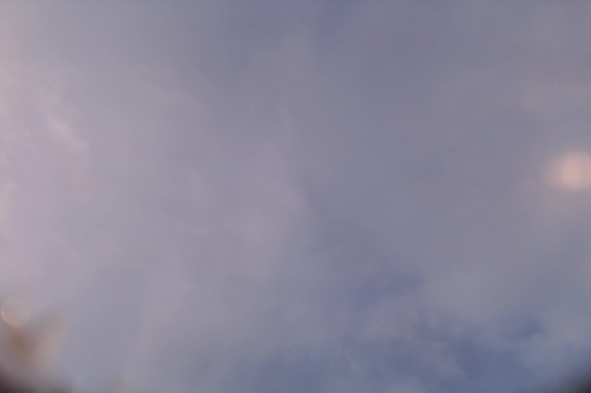
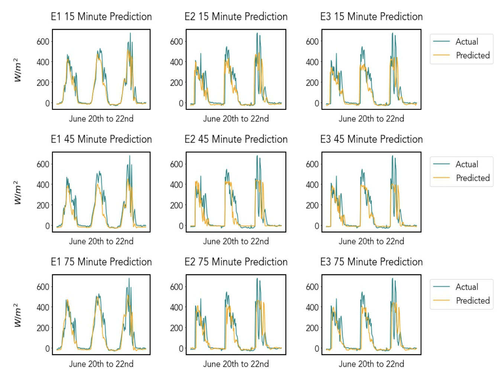

# WeatherNet: Nowcasting Net Radiation at the Edge

## Intro
In the summer of 2020, I (Enrique Nueve) was fortunate enough to be able to get a position as an intern as a Machine Learning Engineer at Argonne National Laboratory. I worked on the SAGE team whose task is to design a cyberinfrastructure for AI over Edge Computing. During my internship, I was tasked with developing an edge-compatible machine learning application that used multiple sensor inputs. With these guidelines, I went about developing a novel nowcasting model for net radiation, called WeatherNet, that uses multiple sensor as inputs and could be run over an edge device. This summer research project went on to become published as a paper at IEEE SusTech 2021 and presented as a poster at AMS 2021 within the AI and Climate track. This post is a high-level overview of the developed methodology for nowcasting net radiation on the edge and the experiment used for testing.

## Motivation
The task of weather forecasting in a short horizon (such as a 24-hour window) is called nowcasting[[1](#references)]. Intrahour nowcasting can provide needed information to optimize industrial applications such as photovoltaic energy management and solar thermal collection and can provide crucial alerts about unexpected dangerous weather changes. Nowcasting is traditionally performed by using radar data and Numerical Weather Prediction (NWP) models [1]. However, NWP models perform poorly at intrahour nowcasting because of the limits of using radar data, such as high computational expense, spatial resolution, and infrequent availability of observations[[2](#references)]. I hypothesized that these methods could be improved by supplementing them with local sensor data.

In particular, I focused on nowcasting net solar radiation, which is a crucial variable for renewable energy planning and agriculture. Given the challenges in using radar data in NWP models for intrahour nowcasting of net radiation, using ground-based sensors may be a viable alternative for achieving the greater temporal resolution required for renewable energy and agricultural applications[[2](#references)]. In addition, assumptions made by both NWP models and satellite retrievals about cloud cover can drastically impact net solar radiation forecasts. To develop a subhourly nowcasting model, I tried using colocated weather sensors and three ground-based cameras and designed and implemented a deep learning model using the data. In addition to examining the feasibility of developing a nowcasting model that uses ground-based sensor data, I explored the feasibility of deploying such a model in the wild. For deployment, I examined the use of an edge computing framework to host the nowcasting model.

Edge computing is an approach to performing computations at the source of data collection[[3](#references)]. For example, say a remote weather station is deployed at a relatively challenging location to access in person. With the weather station being infeasible to reach in person, transferring the data collected over the internet becomes necessary. Transferring such data may be infeasible, however, because of bandwidth limitations. Edge computing offers the alternative of performing analysis and forecasting using the collected data at the remote station; thus, only the analysis or forecast results—a relatively smaller amount of data—need to be transferred over the internet. I sought to design the nowcasting model to run on an edge computing framework. I believe that deploying a nowcasting model on such a framework can reduce the data bandwidth, improve the latency of predictions, and eliminate centralized data collection. To examine the model’s capability to run on an edge computing framework, I tested the methodology for nowcasting with ground-based sensor data on Waggle, an open source edge computing platform [4] developed at Argonne National Laboratory.

## Data
In order to perform nowcasting of net radiation, two kinds of data were collected and used: weather sensor data and ground-based camera image data. Both of these data sources were collected through the Waggle edge computing framework. In particular, the data used in the model was collected by using a Waggle node[[4](#references)] configured with weather sensors and cameras and was located on the Argonne National Laboratory campus in Lemont, Illinois (Lat: 41.701538, Long: -87.994742). The used weather measurements are shown in the table below.

The ground-based camera data came from three different cameras: a sky-facing RGB camera, a horizon-facing RGB camera, and a horizon-facing forward-looking infrared (FLIR) camera. Each of these cameras has a particular motivation for its use. With the FLIR camera, which records temperature, information such as the height of the clouds in an image can be gained, which is an insightful indicator of current and future weather activity. By having both RGB cameras, information such as cloud and snow coverage is provided to the model. Moreover, since net outgoing longwave radiation is influenced by cloud-related properties such as height and optical thickness, having the three cameras allows our data to capture both of these cloud-related properties[[4](#references)]. Through the cameras and weather sensors, a rich source of information was collected for the task of nowcasting net radiation. Examples of images from the cameras are shown below.

## Model and experiments
In order to gauge the data’s ability to be used for the task of nowcasting net radiation, a series of deep learning models were developed, trained, and tested using different combinations of the data. A series of experiments were conducted to compare the performance of nowcasting net radiation using deep learning with different variations of the collected data. As an overview, three experiments will be discussed in this post.

The three experiments were the following: nowcasting net radiation using the weather sensor data with a gated recurrent unit (GRU), nowcasting net radiation using camera images with a ConvLSTM[[5](#references)] from the ground-based camera system, and nowcasting net radiation using images from the ground-based camera system and weather sensor data through a combination of a GRU and a ConvLSTM. These first three experiments with their corresponding datasets and deep learning models used data collected from February 2020 to the second week of June 2020 and then tested on the last two weeks of data from June 2020. Each of the three experiments’ models were trained and tested to predict 15-, 30-, 45-, 60-, 75-, and 90-minute forecast horizons for net radiation.

For the first experiment, a GRU was trained and tested to predict net radiation using the weather sensor data mentioned in the previous section.
The input sequence for the GRU consisted of four sequential samples from the previous hour, the data was sampled every fifteen minutes. The target value was a future period’s net radiation value. The model was trained and tested for 15-, 30-, 45-, 60-, 75-, and 90-minute horizon periods.

For the second experiment, the Convolutional LSTM variant named WeatherNet was trained and tested to predict net radiation using the images collected from the ground-based camera system. As in the first experiment, four sequential samples were used from the previous hour to form an input sequence. Since the system had three cameras (sky-facing RGB, horizon-facing RGB, and horizon-facing forward-looking infrared), three input sequences were made, one for each camera.

Since we had three cameras, the Convolutional LSTM variant had three inputs, one for each image sequence. Because this model was intended to run over an edge computing device that has limited computational resources, the model ideally should have used the least amount of parameters possible in order to ensure that it would fit in CPUs/GPU memory. However, Convolutional LSTMs are computationally expensive because of the large number of parameters used within the layer.

In order to counter this large number of parameters, the model was designed to first feed the input sequences through time-distributed separable convolutional layers. Separable convolutions are an efficient alternative to traditional convolutional layers because they use only about a tenth of the number of parameters that a convolutional layer uses. Thus, the model was capable of encoding the input sequences into a smaller dimension efficiently through separable convolutional layers while preserving the temporal relationships by feeding the sequences first through time-distributed layers. In addition to the three mentioned inputs for the three cameras and their respective images, the model has a fourth input for the weather sensor data listed in the fore-mentioned table.

For the second experiment, the fourth input took in a limited number of variables from the fore-mentioned table: average net radiation, day of the month, month, hour, and minute were fed into a GRU. The GRU’s output was concatenated with the Convolutional LSTM layer’s output, which was then fed into a dense layer with a linear activation function to perform nowcasting of future net radiation. This side information was fed into the model in order to give context to the input image sequences. A diagram of WeatherNet is shown below.

The third experiment also used WeatherNet to perform nowcasting of net radiation. However, it took in the image sequences from the ground-based camera system and all of the variables mentioned in the table of weather measurements.

## Results
For Experiments I–III, the maximum nowcast R2 value was from Experiment I with a 15-minute horizon, producing an R2 of 0.8782. The minimum nowcast R2 was from Experiment III with a 90-minute horizon, producing an R2 of 0.6332. On average, the model’s R2 values stayed above 0.7 for all of the experiments up to a one-hour horizon. Past the one-hour horizon, however, R2 began to drop. The overall results from Experiments I–III can be viewed in table below.

It was observed that E2’s model, which had image data, had a higher R2 value than that of E1’s and E3’s model for 60- and 90-minute horizons.
From these results, one can infer that adding the image data could make the model more robust for greater forecast horizons.

Although the results show the potential of using ground-based sensor data for nowcasting of net radiation, an apparent shortcoming of the models must be addressed. Specifically, all three models suffered at being able to predict sudden jumps. This shortcoming can be seen in the figure below, which shows a series of plots of predictions from Experiments I–III over a three-day forecast between the time window of June 20 to June 22. From the figure below one can also see that on the third peak, representing the net radiation on June 22, the models fail to predict the sudden jumps.

I hypothesize that the improper predictions for the jumps in the data were due to the models not being trained on summer data. For this example prediction shown in the figure below, our model was trained on data from February to the second week of June 2020 and then performed predictions for the last two weeks of June. To further this research, it would be beneficial to collect at least a year’s worth of data and use said data to train the models and then evaluate their predictions. Doing so would allow insight into whether the model’s inability to predict jumps is due to a shortcoming of the limited data, the data itself, the model’s capabilities, or possibly something different altogether.

## Performance on Waggle
To test the efficiency of running WeatherNet on the edge, experiments I-III were tested on an edge node. The node that was used for benchmarking had an Nvidia-AGX-Xavier, a microcomputer designed for machine learning on edge devices. The Nvidia-AGX-Xavier has a peak compute for the GPU of 32 teraops, making this an ideal machine for deep learning over an edge computing framework. As shown from the table below, WeatherNet was easily able to run on an Nvidia-AGX-Xavier.

> “Values measured at time of highest GPU usage”

## Conclusion
Through the use of a ground-based sensor system consisting of cameras and weather sensors, a nontraditional dataset was created to perform nowcasting of net radiation. By experimentation, we were able to gain insight into WeatherNet’s ability to nowcast net radiation using the proposed dataset. WeatherNet was shown to have promising nowcasting abilities for net radiation in subhourly and intrahourly horizons (15–90 minutes); however, it was less successful in predicting sudden jumps. Through future research, we hope to increase the prediction horizon of WeatherNet using the ground-based sensor data and also to correct the underlying issue causing WeatherNet to struggle to predict sudden jumps.

## About the author
Hello, my name is Rick (Enrique) Nueve. I was a summer intern for the SAGE project in 2020. For the 2020-2021 year, I continued to stay on the SAGE project working in areas such as active learning on the edge and out of distribution detection. As of fall 2021, I will be a Ph.D. student in the CS Theory group at CU Boulder.

## References
1. Y. Wang, E. Coning, A. Harou, W. Jacobs, P. Joe, L. Nikitina, R. Roberts,J. Wang, J. Wilson, A. Atencia, B. Bica, B. Brown, S. Goodmann,A. Kann, P.-w. Li, I. Monterio, F. Schmid, A. Seed, and J. Sun,Guidelines for Nowcasting Techniques, 11 2017

2. A. Kumler, Y. Xie, and Y. Zhang, “A new approach for short-term solarradiation forecasting using the estimation of cloud fraction and cloudalbedo,” 10 2018

3. M. Satyanarayanan, “The emergence of edge computing,”Computer,vol. 50, no. 1, pp. 30–39, 2017.

4. P. Beckman, R. Sankaran, C. Catlett, N. Ferrier, R. Jacob, and M. Papka,“Waggle: An open sensor platform for edge computing,” in2016 IEEESENSORS, 2016, pp. 1–3.

5. M. D. Zelinka, C. Zhou, and S. A. Klein, “Insights from a refined de-composition of cloud feedbacks,”Geophysical Research Letters, vol. 43,no. 17, pp. 9259–9269, 2016.

6. X. Shi, Z. Chen, H. Wang, D.-Y. Yeung, W. kin Wong, and W. chunWoo, “Convolutional lstm network: A machine learning approach forprecipitation nowcasting,” 2015.

