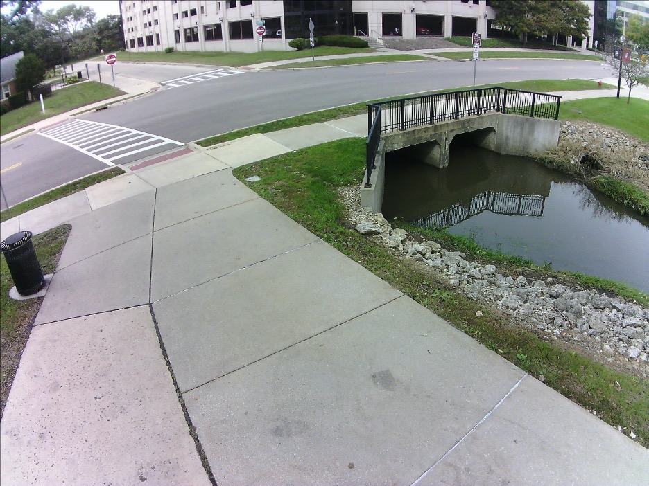

# Water Level Detection

by Priyanjani Chandra

Hello!

My name is Priyanjani Chandra, and I am a graduate student in the Department of Computer Science at Northern Illinois University. As a research intern at Argonne National Laboratory this summer, I worked on a ‘Water Level Detection’ project that employs Computer Vision and Machine Learning based solution to detect the change in the water level of a waterbody. The ultimate goal of this project is to deploy the algorithm on the Array of Things node and detect the water level in real-time.

## Importance of water level detection
Detecting real-time water level in rivers or creeks located in urban areas is crucial, as floods are being a constant threat to the human community living. Floods cause death, damages crop, and properties. With the rise in global warming, many parts of the world are suffering from recurrent floods and excessive rainfall. Deaths due to flooding are often associated with excessive rainfall, which leads to flash flooding. Due to the devastating nature of floods and flash floods, there is a clear need for constant observation of the water level in the rivers and streams. An adequate solution would be the one that is cost-effective, automated, and requires low maintenance. With the advances in computer vision, machine learning, artificial intelligence, and edge computing there is a necessity of algorithms that can be deployed on low-cost powerful computers at data generation locations. In this project, I leveraged the image of the creek to automatically detect the change in water level in the stream with minimal error. I also correlated my results against the data provided by the United States Geographical Survey (USGS)[[1](#references)] for the South Kishwaukee River in DeKalb.

## About the data

> Figure 1- Sample image taken using the AoT node at Northern Illinois University

The images are collected using the downward-facing camera in the Array of Things (AoT)[[2](#references)] node installed on a light pole in front of the Computer Science building at Northern Illinois University (NIU).  The AoT node collect images with a resolution of 96dpi at a frequency of every second. There are a total of 2,580,468 images collected every second during October and November 2019. In 2020, the data is collected from June 29, 2020, to date for every second. Figure 1 shows a sample image from the dataset of the collected images.

## Approach

> Figure 2 – Water Level Detection Algorithm

The algorithm’s detailed approach is shown in the flow chart of Figure 2 and described as follows. One image with a clear view at the bottom part of the bridge becomes the reference image. Images collected from the node are initially processed to identify whether it is a day or night image. Further, I employed a template matching algorithm to find the bridge in the image. The template matching algorithm helps to find an object in a new image based on a pre-defined template.  It works best when the template image and new image looks very similar. Since RGB/color image changes drastically under different light and weather conditions, we converted them into grayscale edge-detection images. The edges are extracted by applying the Holistically-Nested Edge Detection (HED)[[3](#references)] algorithm to the image. A template of the bottom part of the bridge is obtained from the reference image (water level information is pre-determined). This template is further used to find the location of the bridge in the images. By matching the template, the water coordinates are obtained based on the pixel values’ variations within the image. This whole process is applied to the reference image. Linear Regression is applied to the coordinates to obtain the waterline of the template to derive a reference waterline. Waterline for the new images is obtained by utilizing Linear Regression combined with a sliding window concept. The water level change is the difference between the reference water line and the water line detected in the image. Figure 3 shows the images obtained at each step in the algorithm.

> Figure 3 – The transformation from the original image to the detection of water level change for each stage at the algorithm.

I am applying the algorithm to all the images available at this location and comparing the results to data by the United States Geological Survey[[1](#references)].

Next Steps
The existing algorithm I developed is novel and unsupervised, as it is not relying on any training on the images. I am looking at using Detectron2[[4](#references)], an object-detection algorithm, to identify the bottom part of the bridge’s location. The idea is to observe the changes in the location identified by the model.

I am thankful to my mentors for their constant support. I welcome feedback and comments via LinkedIn.

## References
1.	USGS, “United States Geographical Survey,” [Online]. Available: https://waterdata.usgs.gov/nwis/uv?. [Accessed 2020].
2.	P. Beckman, R. Sankaran, C. Catlett, N. Ferrier, and M. Papka, “Waggle: An open sensor platform for edge computing,” in 2016 IEEE SENSORS, 2016, pp. 1-3.
3.	S. Xie and Z. Tu, “Holistically-Nested Edge Detection,” in 2015 IEEE International Conference on Computer Vision (ICCV), 2015.
4.	Y. Wu, A. Kirillov, F. Massa, W. Lo, and R. Girshick, “Github,” Facebook Research, 2019. [Online]. Available: https://github.com/facebookresearch/detectron2. [Accessed 2020].
