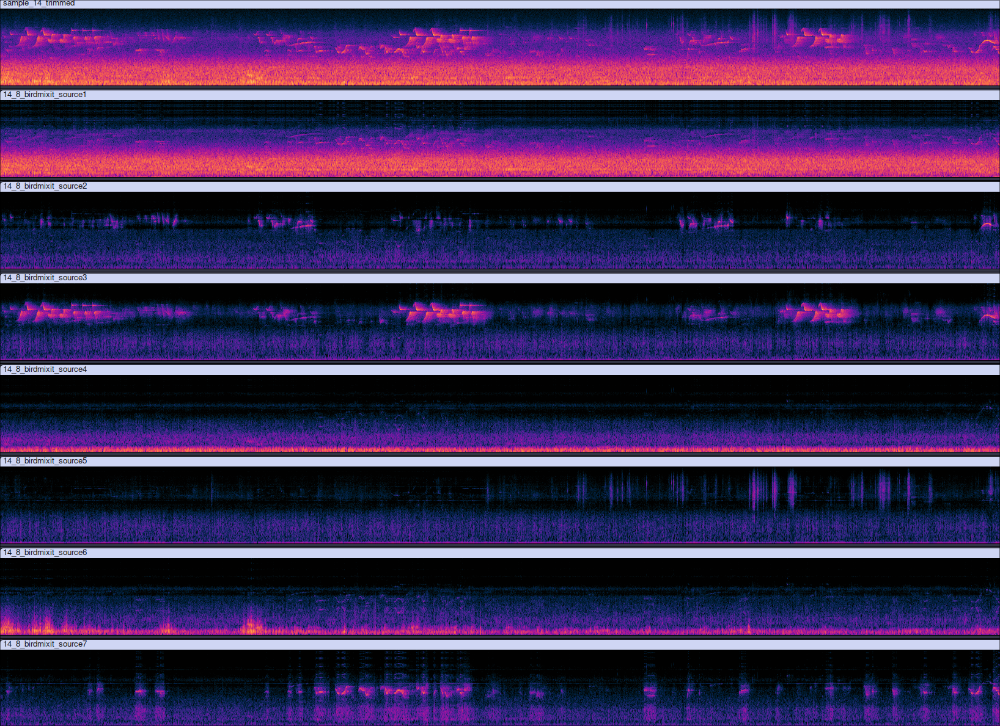
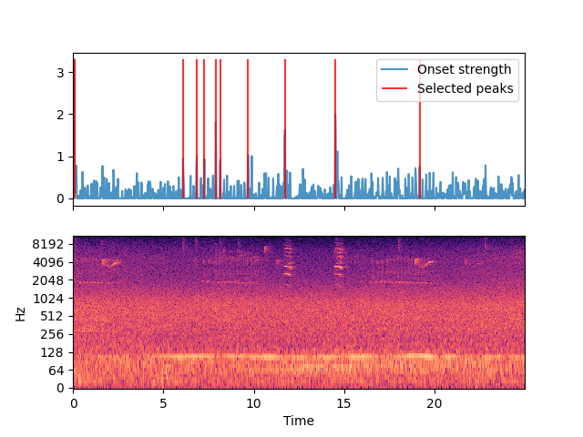

# Sound Separation
By processing data directly at the collection source, edge computing networks like Sage/Waggle offer unique advantages over using centralized servers for ecological monitoring tasks. Audio in particular is useful for tracking metrics like noise pollution from human development or population statistics for vocal wildlife in the area (birds, insects, frogs, etc.). Further analysis can provide deeper insights into the overall health of the ecosystems where nodes are deployed.

However, processing this data comes with its own challenges. Recordings made in the field consequently include environmental background noise and many overlapping sound sources present during the same time and within the same frequency range, making it difficult to parse for valuable information. This project explores the application of a sound separation model (MixIT [1]) to remedy these issues.

## Mixture Invariant Training (MixIT)
The motivation behind using MixIT over any other sound separation model is that fact that it is self-supervised. In contrast to traditional supervised methods, training for a MixIT model can be performed with entirely unlabeled data. This is appealing as it means we can train a model for focused use in a specific ecosystem without expending resources to manually create a labeled dataset beforehand.

**Fig. 1.** *MixIT model architecture [1]*

### Perch
One of the MixIT models we tested is part of another project called Perch [2]. It was pretrained on birdsong recordings. Given that the input data from Morton Arboretum consists mostly of the same, the model performed quite well.

**Fig. 2.** *Spectrograms processed by the 8-output Perch model. From the top: original field recording, road noise, bird 1, bird 2, a second channel of road noise, animal 1, wind noise, bird 3.*

In the sample shown above the Perch model separated out not only birds, but other sounds that it was not deliberately trained for such as noise from the road, wind, and some small animal moving around in the grass nearby. This interesting result is likely due to the self-supervised learning process picking up on background noise patterns that were common across many recordings in the original training dataset.

## Future Work
### Data Preprocessing
Although MixIT does not strictly require it, separation performace is improved significantly by taking some time to preprocess training data. One approach could be to strategically slice recordings for relative peaks in volume and/or frequency, as shown below. This would counteract the disproportionate amount of background noise present in field recordings and minimize wasted data.

**Fig. 3** *Preliminary results from peak-detection script*

### Federated Learning
The long-term goal of this project is to implement a MixIT separation model as part of a federated learning network at the edge. In such a system, nodes would use their onboard GPUs to collaboratively train a single model from the data their own sensors are collecting. Model updates are sent upstream to a central server, which then combines changes and sends the full model back to each node to continue the process. This provides numerous advantages, including reducing strain on each individual node while possibly improving inference performance of the resulting model.

---

## References

1. Scott Wisdom, Efthymios Tzinis, Hakan Erdogan, Ron J. Weiss, Kevin Wilson, John R.
Hershey, "Unsupervised Sound Separation Using Mixture Invariant Training", Advances in
Neural Information Processing Systems, 2020.

2. Tom Denton, Scott Wisdom, John R. Hershey, "Improving Bird Classification with
Unsupervised Sound Separation", Proc. IEEE International Conference on Audio, Speech, and
Signal Processing (ICASSP), 2022.