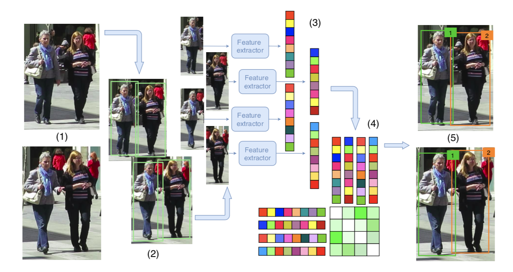
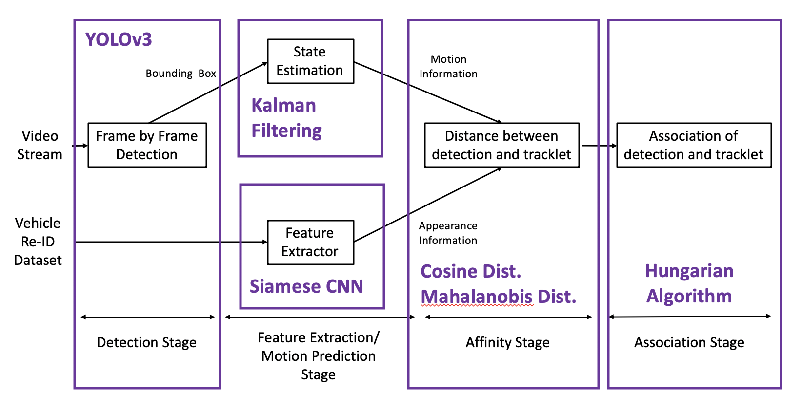

# Vehicle Tracking
Hi there!
My name is Hazel Han, and I’m a graduate student at Purdue University pursuing MS in Computer and Information Technology.
This summer, I worked as a research intern at Argonne National Laboratory on a “Vehicle Tracking” project, pursuing the ultimate goal of running tracker at the edge of the smart sensor network, and I’d like to share what I’ve done throughout the summer.

#Smart City? Urban Surveillance?
Vehicle is one of the most useful and indispensable machines in our lives. Every day people drive to work, goods are transported by vehicles, and people even play sports with vehicles. Seriously, I can’t even imagine life without vehicles. However, as they are so close to human lives, there are also multifarious problems that vehicles are involved with, such as traffic congestion, vehicle theft and trafficking, and hit-and-run. One way to deal with those vehicle-related problems is to track each vehicle. An intelligent traffic surveillance system that could track each vehicle and figure out the trajectory of each vehicle will play a significant role in various tasks such as traffic flow analysis or catching hit-and-run criminals. Therefore, based on such needs for an intelligent traffic surveillance system, I’ve conducted research on developing a near real-time vehicle tracking model that could be used towards the intelligent traffic surveillance system.

With the growth of the Internet of Things (IoT) related technology, a lot of governments, national laboratories, and companies are to construct a smart city infrastructure these days. (Su, Li & Fu, 2011). Argonne National Laboratory is one of those institutions. Beckman et al. at Argonne National Laboratory have been developing an open platform named Sage, a smart software-defined sensor network, that could be used for various civil applications and AI-related researches. So during this summer, I worked on implementing a deep learning-based vehicle tracking model that could be deployed at the edge of Sage, and I’d like to share a high-level description about my model in this post.

> Figure 1. Tracking on random traffic video from YouTube

# Multiple Object Tracking
Before we go into details of the model I’ve implemented, I’d like to first introduce how the general computer vision-based tracking algorithms work. Although there are various approaches for developing computer vision-based tracking systems, the gist of tracking algorithms is pretty much the same for every tracking algorithms.
Most of the tracking systems that have been proposed since 1990s are feature-based tracking systems, which use feature vectors extracted from the image frames to associate certain feature vector from certain image frame with another similar feature vector extracted from another frame.
The general tracking scenario is as follows:

Feature extraction from each frame
Measure the similarity between feature vectors
Associate those similar vectors with unique tracking ID (similar feature vector = the same object)
Having this basic scenario, various methods and techniques have been explored by researchers to come up with better performing tracking algorithms. However, while the object detection task has been continuously addressed by the computer vision community with well-organized benchmarks for the task since the early 2010s (ImageNet), there has been rather limited work on the task of object tracking although it can be used for various applications. To address such issue, Leal-Taixe ́ et al. have launched Multiple Object Tracking Challenge (MOTChallenge) in 2015, in order to provide a novel multiple object tracking benchmark, which consists of a large-scale well-annotated dataset and a unified evaluation framework for effective quantification of multi-object tracking.

Since the first MOTChallenge, a significant number of researchers have participated and contributed to the challenge, proposing state-of-the-art tracking algorithms, and there is an obvious trend in submitted algorithms. Most of the MOT algorithms take tracking-by-detection approach.
To be more specific, a set of detections (i.e. bounding boxes identifying the targets in the image) are extracted from the video frames and are used to guide the tracking process, usually by associating them together in order to assign the same ID to bounding boxes that contain the same target.
Let’s take an example of a pedestrian tracking shown in the below figure:

### Tracking-by-Detection

> Figure 2. Usual workflow of MOT Algorithms (Ciaparrone et al., 2020)

Given the raw frames of a video (1), an object detector is run to obtain the bounding boxes of the objects (2). Then, for every detected object, different features are computed, usually visual and motion ones (3). After that, an affinity computation step calculates the probability of two objects belonging to the same target (4), and finally an association step assigns a numerical ID to each object (5). (Ciapparrone et al., 2020)

So this is how most of the current state-of-the-art tracking algorithms work.

# Deep SORT based Vehicle Tracker
Now I’d like to introduce a specific tracker, Deep SORT, that I used as a baseline. Deep SORT is one of the fastest trackers that takes a pragmatic approach to multiple object tracking with a focus on simple, effective algorithms. (Wojke et al., 2017). Following the general tracking scenario that I just described in the previous section, Deep SORT utilizes Kalman Filtering and Hungarian Algorithm to expedite the speed of tracker. Based on Deep SORT, which intends to track pedestrians from the given videos, I have customized and implemented the tracking model which tracks vehicles.
The detailed model flow is depicted in Figure 3. The model has four stages – detection stage, feature extraction/motion prediction stage, affinity stage, and association stage – and here is the detailed explanation about each stage:

Detection stage: detect objects from each input frame with state-of-the-art object detectors, and generate bounding boxes around the detected objects; YOLOv3
Feature extraction/motion prediction stage: a feature extractor extracts feature vector of target objects (NVIDIA AI City Challenge Re-Identification dataset used), and a motion predictor predicts the next position of each tracked target; Feature Extractor – Siamese CNN, Motion Predictor – Kalman Filtering
Affinity stage: feature vectors and motion predictions are used to compute a similarity/distance score between pairs of detections and/or tracklets; Mahalanobis/Cosine Distance
Association stage: the similarity/distance measures are used to associate detections and tracklets belonging to the same target by assigning the same ID to detections that identify the same target; Hungarian Algorithm

> Figure 3. Model Flow

As this post delivers high-level explanation about the model, if you want a more specified explanation or would like to play with the model please visit: https://github.com/heejae1213/object_tracking_deepsort (Have code but readmes are in progress)

And below is the result of tracking on the video from Argonne Main Gate.

> Figure 4. Tracking on the video from Argonne Main Gate

## Conclusion
In conclusion, this summer, I could implement the Deep SORT-based vehicle tracker, and run it on the videos obtained from Argonne Main Gate camera.
For future work, I’d like to make the model work in a near real-time manner and deploy it at the edge of Sage. Also, after successfully deploying the model at a single Sage node, expanding the model to multiple Sage nodes would allow tracking vehicles across certain space.
There are a lot of improvements that could be done on this topic, and I’m looking forward to making a better version model!

I am always open to comments, feedbacks, and questions! If you’d like to reach out to me, feel free to connect me on Linkedin. 🙂

## References
1. Wojke, N., Bewley, A., & Paulus, D. (2017, September). Simple online and realtime tracking with a deep association metric. Proceedings from 2017 IEEE international conference on image processing (ICIP) (pp. 3645-3649). IEEE. https://doi.org/10.1109/ICIP.2017.8296962
2. Beckman, P., Sankaran, R., Catlett, C., Ferrier, N., Jacob, R., & Papka, M. (2016, October). Waggle: An open sensor platform for edge computing. Proceedings from 2016 IEEE SENSORS (pp. 1-3). IEEE. https://doi.org/10.1109/ICSENS.2016.7808975
3. Ciaparrone, G., Sánchez, F. L., Tabik, S., Troiano, L., Tagliaferri, R., & Herrera, F. (2020). Deep learning in video multi-object tracking: A survey. Neurocomputing, 381, 61-88. https://doi.org/10.1016/j.neucom.2019.11.023
4. Su, K., Li, J., & Fu, H. (2011, September). Smart city and the applications. Proceedings from 2011 international conference on electronics, communications and control (ICECC) (pp. 1028-1031). IEEE. https://doi.org/10.1109/ICECC.2011.6066743
5. https://github.com/nwojke/deep_sort
6. https://github.com/abhyantrika/nanonets_object_tracking
7. https://github.com/nandinib1999/object-detection-yolo-opencv
8. https://youtu.be/UM0hX7nomi8
