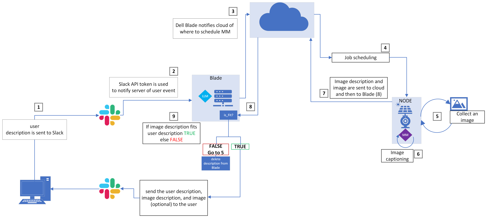
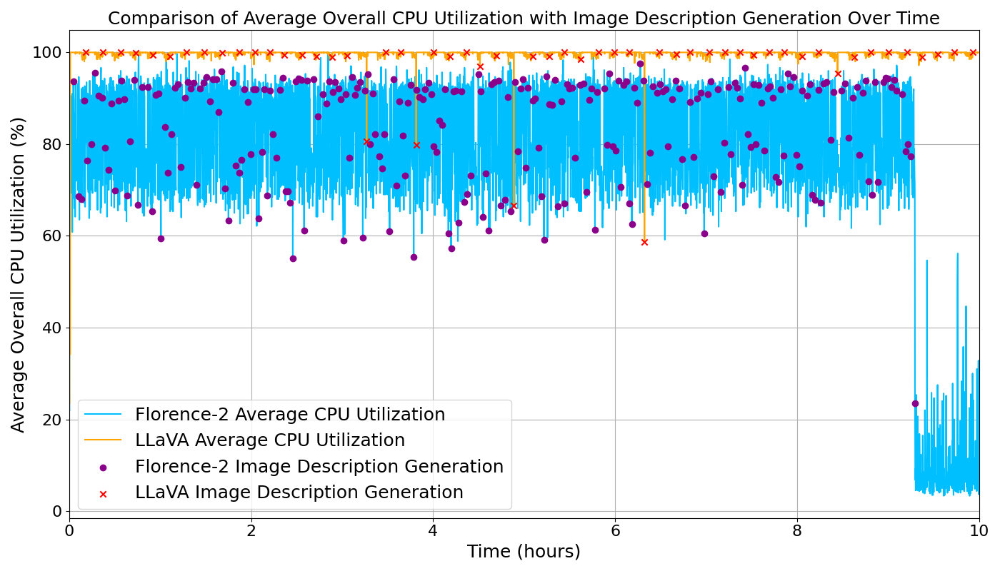

# Creating a System to Find Events in Real-Time

Across the United States and the world, the distributed network of Sage nodes captures over 2500 images per day. These nodes have the potential of capturing photos with important features such as smoke, wildlife, and emergencies. Each image contains unique characteristics which, until now, were hard to look for without manually searching through the Sage database. With both the images and users in mind, this project has two goals: harness the power of machine learning to describe photos as they are taken, and build a user-friendly system to allow others to find what they are looking for within our database.

## Using machine learning to describe an image

Models that can take in one input and generate a different type of output are called multimodal models. For the purpose of this project, we were looking for a model that could take in an image as an input and generate text as an output. It had to be able to run with as little processing power as possible so that, if someone was gathering other data on the same device, other programs could run simultaneously. In addition, and most importantly, the model had to be accurate in its descriptions.

After some searching, two models, LLava, and Florence-2-base, matched the criteria that was looked for. LLaVA has under five gigabytes worth of data and Florence-2-base has under half of a gigabyte of data. These sizes make it easy to load on any device we have. Also, both displayed medium to high accuracy in describing the images that were given to them.

This figure shows a test conducted with over 200 images. LLaVA was tested on one node and Florence-2-base was tested on another. Both models were given the same amount of images and were left to generate descriptions. While LLaVA took over 24 hours to generate 200 descriptions, it took Florence-2-base 9 hours. In addition, the total CPU usage for the node was 20% less while Florence-2-base than while LLaVA was running. Also, Florence-2-base generated descriptions 300% faster with the same relative accuracy.

Currently, Florence-2-base has been selected for the development stages of the project. As multimodal models become more accurate and smaller, this decision will be reevaluated to stay on the cutting edge of machine learning.

## Building a user-friendly system

The Sage/Waggle team communicates to each other through the Slack messaging application. Slack has a robust API that makes it easy to develop programs that can run directly through their system. It was selected as the optimal choice to allow users to talk directly with the Sage systems.

A bot was created called "Sage Search" which runs on one of the servers in the Sage network. Sage Search contains the large language model Gemma-2 which understands user queries. Sage Search also tells the image capturing devices when to start generating descriptions based on what the user requests. Then, it sends back images that the user might want to see.

This photo shows a user requesting to find an image with a "white car" on a specific device. Although the generated description may have inaccuracies, the key features of the image are noted in detail. This highlights the system working as it should. The user received an image they were looking for just by sending a slack message. 

## Conclusion

Florence-2 emerged as the best multimodal model due to its efficient use of resources and processing abilities. By integrating Gemma-2 within the Slack framework as the intermediary between the user and the images, the system enables user-friendly retrieval based on search queries. As this project moves from being a small prototype and into a developed application, there will be much more to consider. As more users enjoy this system, data handling will become an important topic. Considerations will also have to be made for handling images and user requests in a manner that adheres to our privacy and safety guidelines. The search system continues to develop, and, as it develops, this integration will further enhance the Sage network's capability to retrieve images effectively.
